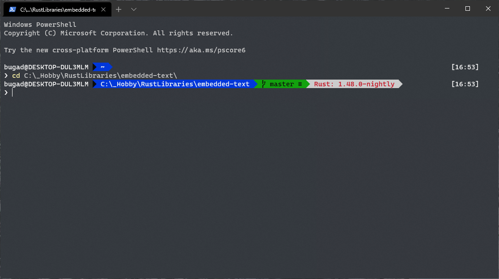

Rustic Paradox
=======================

This repository takes the awesome Paradox theme from [oh-my-posh](https://github.com/JanDeDobbeleer/oh-my-posh) and
adds a new prompt section that displays the currently active Rust compiler version if the current folder
contains a `.rs` or `Cargo.toml` file.

Installation
------------

 * Make sure you have `oh-my-posh`. Refer to their GitHub page for instructions.
 * Copy the `Rustic-Paradox.psm1` file to where `$ThemeSettings.MyThemesLocation` points you.
 * Activate the theme by issuing the `Set-Theme Rustic-Paradox` command.
 * Enjoy
